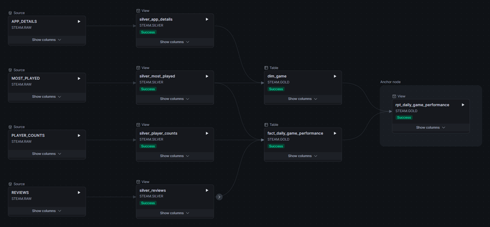

# Steam Data Pipeline

End-to-end, event-driven ELT pipeline: Steam API → AWS Lambda → S3 (data lake) →
Snowpipe → Snowflake medallion architecture, transformed by dbt running natively
in Snowflake and triggered by data arrival — the only clock in the system is the
initial daily cron.

```
EventBridge (cron 06:00 UTC)
   └─> Lambda "chart" ──> S3: raw/most_played/
          └─ fans out 6 async workers ──> S3: raw/{reviews,player_counts,app_details}/
                                             │  S3 event notification
                                             ▼
                                          Snowpipe ──> RAW (bronze, VARIANT)
                                                          │  streams detect new rows
                                                          ▼
                                          triggered task ──> EXECUTE DBT PROJECT
                                                          │
                                         SILVER (typed/deduped) → GOLD (star schema)
```

Every stage is woken by the previous stage's output: the S3 PUT event triggers
Snowpipe, the loaded rows fill streams, and a triggered task
(`WHEN SYSTEM$STREAM_HAS_DATA`) runs the dbt build — no polling, no schedule
coupling.

## dbt lineage



*Bronze sources (RAW) → typed/deduped silver models → gold star schema, as
compiled by dbt from `ref()`/`source()` dependencies.*

## Datasets

| Dataset | Endpoint | Notes |
|---|---|---|
| most_played | ISteamChartsService/GetMostPlayedGames | daily top-100 snapshot; drives the appid list |
| player_counts | ISteamUserStats/GetNumberOfCurrentPlayers | point-in-time CCU; 404s for unlisted titles |
| reviews | store.steampowered.com/appreviews | last 24h via cursor pagination |
| app_details | store.steampowered.com/api/appdetails | game metadata; rate-limited (~200 req/5min) |

## Gold layer

- `dim_game` — one row per game ever seen on the chart; store attributes
  left-joined so facts always resolve (unlisted games get a placeholder +
  `has_store_page = false`)
- `fact_review` — one row per review, incremental merge on `review_id`
- `fact_daily_game_performance` — daily grain: rank, peak CCU, snapshot player
  count, review sentiment aggregates
- `rpt_daily_game_performance` — reporting view flattening the daily fact with
  game attributes (a view, so it can never drift from the dimension)

## Sample output

Browsable snapshots of the gold tables (GitHub renders them as tables):
[daily game performance](data_samples/sample_daily_game_performance.csv) ·
[game dimension](data_samples/sample_dim_game.csv) ·
[reviews fact](data_samples/sample_fact_review.csv) —
see [data_samples/](data_samples/) for context.

## Repo layout

```
steam_api.py            shared extraction logic (single source of truth)
extract_steam.py        local CLI (testing / backfills) — thin wrapper
lambda/handler.py       production Lambda adapter (chart + worker fan-out)
infra/                  AWS setup guides (S3/IAM, Lambda/EventBridge/Snowpipe)
snowflake/01-05         database, storage integration, stage, Snowpipe,
                        stream-triggered dbt task
snowflake/alternative_v1_snowpark/
                        not deployed: same pipeline orchestrated entirely by
                        Snowflake Tasks + Snowpark (see its README for why)
dbt/                    dbt project (runs as a DBT PROJECT object in Snowflake)
.github/workflows/      CI/CD: PR checks, manual backfill, and auto-deploy of
                        the Lambda + dbt project on pushes to main
DEPLOYMENT.md           step-by-step deployment runbook with verification gates
```

## Deployment

Full runbook with per-step verification gates: [DEPLOYMENT.md](DEPLOYMENT.md).
Short version: local dry-run → S3/IAM setup → Snowflake storage-integration
handshake → Lambda + EventBridge → Snowpipe wiring → upload dbt project to a
Snowsight workspace, deploy as `STEAM.OPS.STEAM_DBT` → streams + triggered task.

## Design notes

- **Raw stays raw**: bronze is single-VARIANT-column NDJSON — API schema changes
  never break ingestion, only dbt models.
- **Idempotent everywhere**: Snowpipe per-file load history, silver QUALIFY
  dedup, incremental merge on `review_id` — reruns and overlapping 24h windows
  never duplicate.
- **Fan-out under the Lambda cap**: chart invocation fans out 6 parallel workers
  (3 datasets × 50-appid chunks); worst worker ~3 min vs the 15-min limit.
- **No long-lived credentials in the pipeline**: Snowflake reaches S3 by
  assuming an IAM role (storage integration + external ID); Lambda uses its
  execution role; dbt runs in-session inside Snowflake with no stored password.
- **Cost-driven design**: extraction is ~80% network waits, so it runs on free
  Lambda compute rather than a Snowflake warehouse billed to sleep. Snowflake
  does only warehouse-worthy work (~$3/mo at this scale).
- **Referential integrity vs. source reality**: the chart endpoint lists games
  the store endpoint won't serve (unlisted titles). A dbt relationships test
  caught this; fixed by re-basing `dim_game`'s spine on observed chart games
  rather than deleting facts or the test.
- **v1 alternative preserved** (`snowflake/alternative_v1_snowpark/`): the same pipeline
  orchestrated entirely by Snowflake Tasks + Snowpark — built, tested, and
  retired because paying a warehouse to sleep between rate-limited API calls
  is structurally the wrong cost model.
